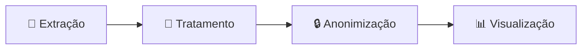

# README

## Estrutura do Projeto

...content before this section...

## 🔄 Entenda o Projeto

### Pipeline: Da Extração à Visualização

#### 1. **🔌 Extração de Dados**
Coleta automatizada de tickets do sistema GLPI via **Selenium** e **Python**.
> ⚠️ *Script não publicado por conter credenciais e endpoints internos do órgão*

#### 2. **🧹 Tratamento de Dados**
Processamento com **Pandas** para limpeza, normalização e estruturação.
- Tratamento de valores nulos
- Padronização de datas e categorias
- Normalização de nomes de cidades

📁 *Implementação similar ao projeto:* [support-tickets-analytics](https://github.com/dataPalacio/support-tickets-analytics/blob/main/scripts/main.py)

#### 3. **🔒 Anonimização**
Execução do [`anonimizacao.py`](notebooks/anonimizacao.py) para proteção de dados sensíveis:
- Hash de identificadores pessoais
- Mascaramento de contatos e documentos
- Generalização de localizações
- Remoção de termos internos do órgão

#### 4. **📊 Visualização**
Integração com dados geográficos do **IBGE** e publicação no **Power BI**.
- Enriquecimento com códigos de municípios
- Modelagem dimensional (Star Schema)
- Dashboard público interativo

🔗 [Ver Dashboard ao Vivo](https://app.powerbi.com/view?r=eyJrIjoiOGY3MWMwMmMtNjU5Zi00ZGQ0LWI3OTctNGE2YmM1MTZlYmEyIiwidCI6ImQxODBiZjJiLTU5MTQtNGRkZC1hMDUyLWZhMmY3MTdmNmY4YyJ9)

## Stack Técnica
| **Extração** | Python, Selenium |